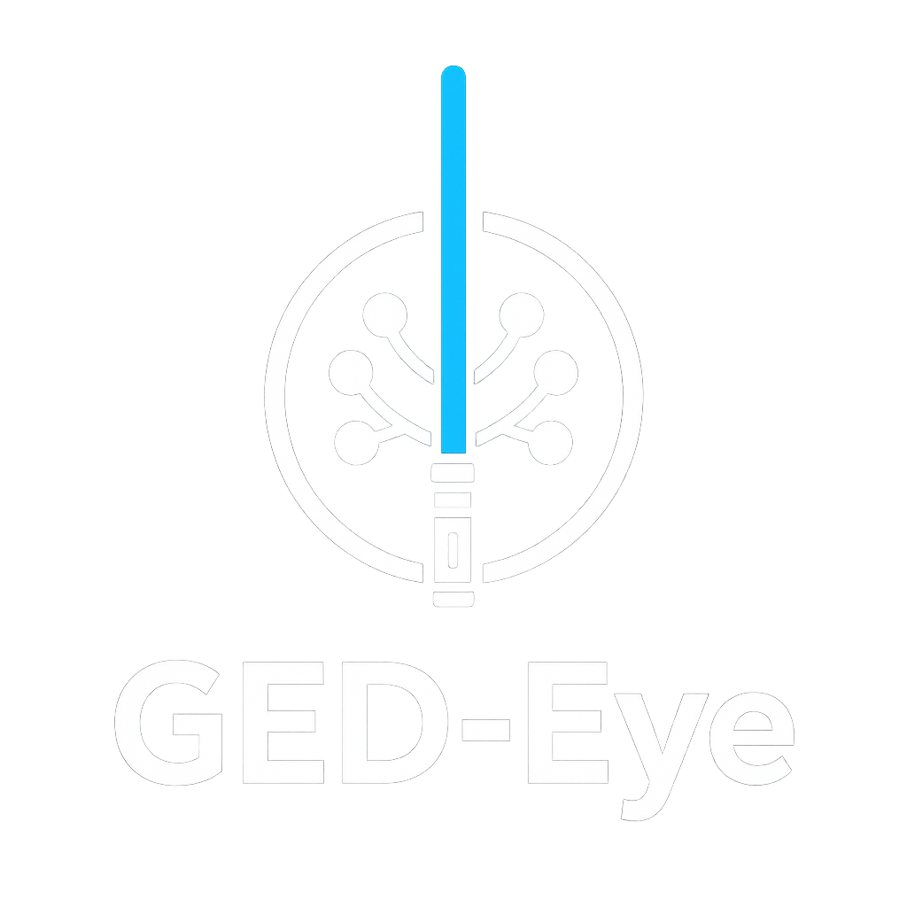

<div align="center" style="background-color: #1a1a1a; padding: 20px; border-radius: 10px;">
  
</div>

# GED-Eye

A modern, interactive family tree viewer for GEDCOM files. Because other family tree viewers look like they're stuck in 1999.

See it live [here](https://robacourt.github.io/ged-eye) showing my family tree!

## What is this?

GedEye takes GEDCOM genealogy files and turns them into a beautiful, interactive web-based family tree visualization. Click on any person to see their immediate family - parents, spouses, and children - all rendered as an animated graph.

## Features

- 🎯 **Interactive visualization** - Click any person to make them the focus
- 🚀 **Lazy loading** - Pre-processes large GEDCOM files into individual JSON files for instant loading
- 🎨 **Modern UI** - Built with Cytoscape.js for smooth graph rendering
- ⚡ **Fast** - Handles thousands of people without breaking a sweat
- 🎭 **Gender color coding** - Blue for males, pink for females
- 📊 **Relationship lines** - Visual connections between family members

## Quick Start

```bash
# Install dependencies
npm install

# Process your GEDCOM file (only needed once)
npm run process-ged

# Start the dev server
npm run dev

# Open http://localhost:5173 in your browser
```

## Project Structure

```
├── acourt.ged              # Your GEDCOM file
├── scripts/
│   ├── gedParser.js        # GEDCOM parser
│   └── processGed.js       # Converts GED to JSON files
├── src/
│   ├── main.js             # App entry point
│   ├── dataLoader.js       # Lazy loads person data
│   ├── familyTreeView.js   # Cytoscape graph visualization
│   └── style.css           # Styles
├── public/
│   └── data/people/        # Generated JSON files (one per person)
└── tests/                  # Unit tests
```

## How it Works

1. **Pre-processing**: The `npm run process-ged` script parses your GEDCOM file and creates individual JSON files for each person (e.g., `I1.json`, `I122.json`). This makes loading super fast.

2. **Lazy Loading**: When you view a person, only their immediate family is loaded. No need to load all 3000+ people at once.

3. **Graph Visualization**: Cytoscape.js renders the family as a graph with the selected person in the center, parents above, children below, and spouses to the sides.

## Tech Stack

- **Vanilla JavaScript** - No framework bloat, just modern ES6+
- **Cytoscape.js** - Graph visualization library
- **Vite** - Lightning-fast dev server and build tool
- **Vitest** - Unit testing

## Testing

```bash
npm test
```

## Changing the Default Person

Edit `public/data/people/index.json` and change the `firstPersonId` field to any person ID (e.g., `"I122"`).

## Future Enhancements

- [ ] Smooth animations when switching between people
- [ ] Face detection and avatar extraction from photos
- [ ] Zoomed-out view showing hundreds of people at once
- [ ] Search functionality
- [ ] Info panel with detailed person information
- [ ] Export visualizations

## Credits

Built by Rob with Claude Code. Vibes only. 🌊

## License

MIT - Do whatever you want with it
